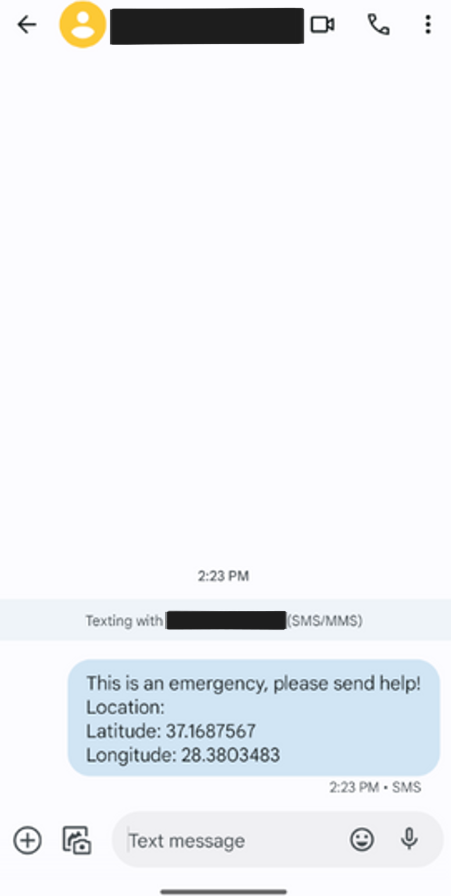

# SpeedScroll

 

### Description
SpeedScroll is a project developed by 6 software engineering bachelors.
Our application provides its users with the shortest-time routes,
other than its main feature we have also developed 2 side features:
"Fav Place" and "Red Angel".

### Table of Contents
- [Installation](#installation)
- [Usage](#usage)
- [Contact](#contact)

## Installation
Follow the steps below to run this project on your local machine.
### 1. Installing Required Tools
Before you start working on the project, make sure you have the necessary tools installed on your system:
#### Flutter SDK
Follow the instructions on [Flutter's official website](https://flutter.dev/docs/get-started/install) to install Flutter SDK.
#### Android Studio
Download and install Android Studio [here](https://developer.android.com/studio). Make sure you install Flutter and Dart plugins:
1. Open Android Studio.
2. Go to `File > Settings > Plugins` menu.
3. In the `Marketplace` tab, search for the `Flutter` plugin and install it. This will automatically install the Dart plugin as well.
#### Visual Studio Code (Optional)
Download and install Visual Studio Code [here](https://code.visualstudio.com/). Then install Flutter and Dart plugins:
1. Open VS Code.
2. Go to the `Extensions` menu (`Ctrl+Shift+X`).
3. Search for the `Flutter` plugin and install it. This will automatically install the Dart plugin as well.
   <br/>
   <br/>
   
### 2. Clone the Project
Download the project to your local machine by cloning the GitHub repository:
```bash
> git clone https://github.com/USERNAME/REPOSITORY_NAME.git
> cd REPOSITORY_NAME
```

<br/>
<br/>

### 3. Install Dependencies
Run the following command in the terminal to install Flutter dependencies:
```bash
> flutter pub get
```

<br/>
<br/>

### 4. Set API Keys
To add API keys, follow these steps:
1. Go to the file named `map_page.dart` in the `lib/screens/` directory.
2. Set the contents of the `map_page.dart` file as follows:
```bash
Future<void> _getDirections() async {
    String apiKey =
        "YOUR_GOOGLE_MAPS_API_KEY "; // Google Directions API key
```

<br/>
<br/>

### 5. Run the App
#### Android Studio Emulator
Open Android Studio and create a virtual device via `AVD Manager`:
1. Open Android Studio.
2. Go to `Tools > AVD Manager` menu.
3. Click `Create Virtual Device`.
4. Select a device and continue by clicking `Next`.
5. Select a system image and continue by clicking `Next`.
6. Make the necessary configurations and create the emulator by clicking `Finish`.
#### Running the App in Emulator
To run the Flutter app on the emulator, use the following command in the terminal:
```bash
> flutter run
```

#### APK Installation (Direct to Device)
If you have an Android device, you can install the APK file directly on the device. To do this, follow these steps:
1. In the root directory of your project, navigate to the `build/app/outputs/flutter-apk folder`.
2. Find the `app-release.apk` file.
3. Connect your Android device to your computer with a USB cable.
4. Copy the file to your device.
5. Finally, find and open the file on your device and install it.

## Usage
### Basic Usage
Once the installation steps are complete, you have to register and log an account in the application.
You will be directed to the main page, where you can use all application features other than the settings page,
to create routes between point A to point B, you have to press on point A and press hold at point B.
Multiple routes will appear on the map, blue and red. Blue is the shortest-time route and red ones are the alternative routes which are longer than the main route.
From then on you have to move. As a pedestrian or as a driver.
### Fav Place
You can use this feature by pressing the heart-shaped button on the main page (located at the bottom right),
from then on the feature will guide you.
### Red Angel
You can use this feature by pressing the SOS button on the main page (located at bottom middle),
from then on the feature will guide you.
> [!NOTE]
> It should be noted that we are artificially simulating the traffic data at the moment,
> SpeedScroll, in its current condition, is not ideal for real-life use.  
## Contact

### Ali Zekai Deveci
[LinkedIn](https://www.linkedin.com/in/alizekaid?utm_source=share&utm_campaign=share_via&utm_content=profile&utm_medium=android_app)

### Ela Semra Sava
[LinkedIn](https://www.linkedin.com/in/elasemrasava?utm_source=share&utm_campaign=share_via&utm_content=profile&utm_medium=android_app)

### Emir Turgut
[LinkedIn](https://www.linkedin.com/in/emir-turgut?utm_source=share&utm_campaign=share_via&utm_content=profile&utm_medium=android_app)

### Emre Türkoğlu
[LinkedIn](https://www.linkedin.com/in/emre-t%C3%BCrko%C4%9Flu-53601b280?utm_source=share&utm_campaign=share_via&utm_content=profile&utm_medium=android_app)

### Hafize Sanlı
[LinkedIn](https://www.linkedin.com/in/hafize-sanl%C4%B1-51101a280?utm_source=share&utm_campaign=share_via&utm_content=profile&utm_medium=android_app)

### Münib Akar
[LinkedIn](https://www.linkedin.com/in/m%C3%BCnibakar?utm_source=share&utm_campaign=share_via&utm_content=profile&utm_medium=android_app)

## Screenshots

<table>
  <tr>
    <td></td>
    <td></td>
    <td></td>
    <td></td>
    <td></td>    
  </tr>
  <tr>
    <td></td>
    <td></td>
    <td></td>
    <td></td>
    <td></td>
  </tr>
  <tr>
    <td></td>
    <td></td>
    <td></td>
    <td></td>
    <td></td>
  </tr>
</table>
